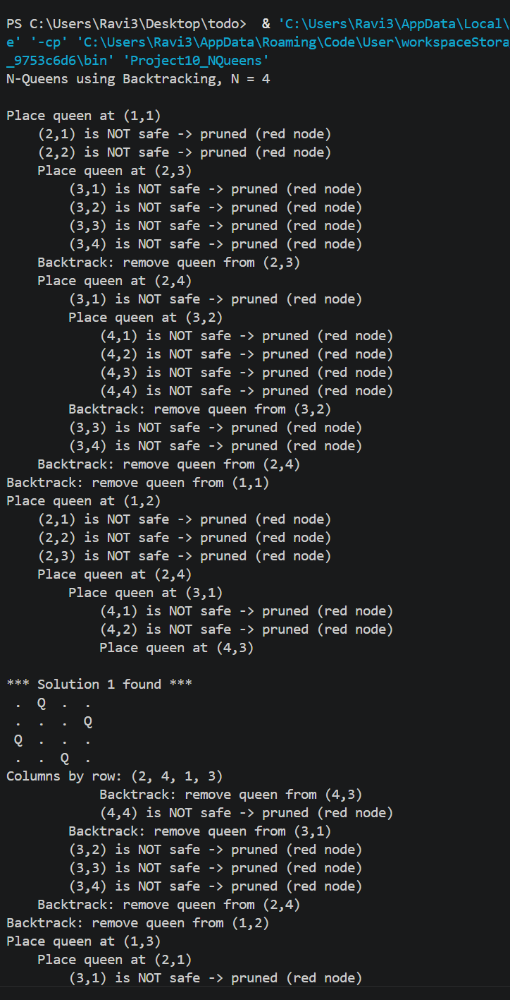
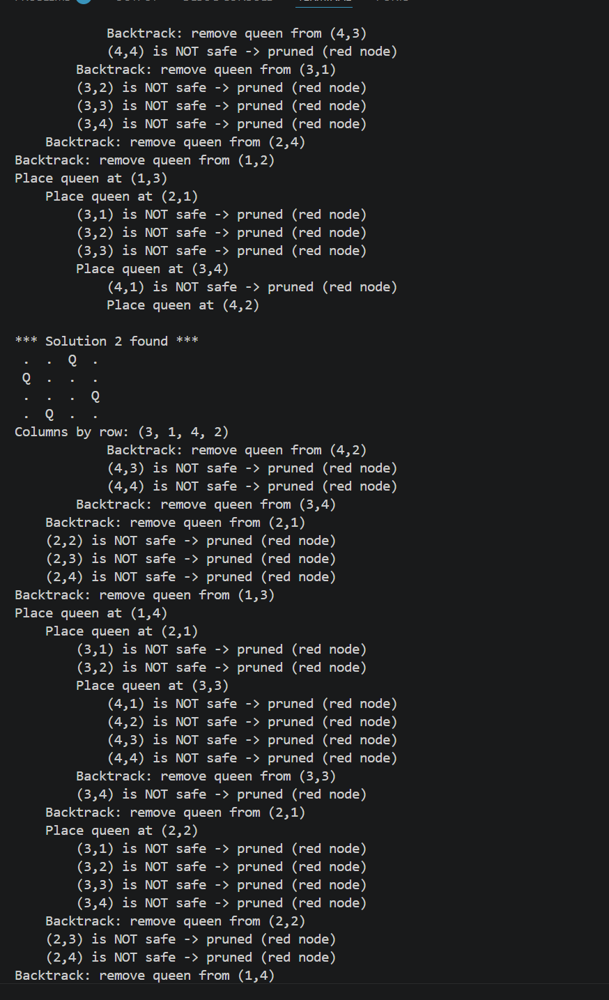

# N-Queens Problem using Backtracking

## Description
This project solves the N-Queens problem for N = 4 using backtracking. One queen is placed in each row, and a placement is rejected if it shares a column or diagonal with an earlier queen. The program prints every placement, pruned branch and backtrack, and the state space tree is visualized through prompt engineering with an AI tool.

**Unit:** IV – Backtracking | **Project:** 10 | **Language:** Java

## Algorithm

```
NQueens(row, N):
    if row == N + 1:
        print solution
        return
    for col = 1 to N:
        if isSafe(row, col):
            place queen at (row, col)
            NQueens(row + 1, N)
            remove queen from (row, col)      // backtrack

isSafe(row, col):
    for each earlier row r < row:
        c = column of queen in row r
        if c == col or |c - col| == |r - row|:
            return false
    return true
```

**Time complexity:** O(N!) in the worst case, because pruning removes most of the N^N possible arrangements.

## How to Run
```
javac Project10_NQueens.java
java Project10_NQueens
```

## Prompt Used
"Visualize the state space tree for N=4 queens, marking invalid branches in red."

(The same prompt is saved in `Prompt.txt`.)

## Output

### 1. Program Output (Java console)

The program prints every placement, every pruned (unsafe) position and every backtrack.




**Solution 1 found** (columns by row: 2, 4, 1, 3):
```
 .  Q  .  .
 .  .  .  Q
 Q  .  .  .
 .  .  Q  .
```

**Solution 2 found** (columns by row: 3, 1, 4, 2):
```
 .  .  Q  .
 Q  .  .  .
 .  .  .  Q
 .  Q  .  .
```

### 2. State Space Tree (Visualization)


**Solutions found for N = 4:**
- Columns (2, 4, 1, 3), path (1,2) → (2,4) → (3,1) → (4,3)
- Columns (3, 1, 4, 2), path (1,3) → (2,1) → (3,4) → (4,2)

### How the output matches the tree
- Each `Place queen at (r,c)` line is a valid node (blue or green) in the tree.
- Each `(r,c) is NOT safe -> pruned (red node)` line is a red node.
- Each `Backtrack: remove queen from (r,c)` line is the algorithm returning to the parent node.
- The trace shows dead ends under (1,1) at (2,3) and (3,2), and under (1,4) at (2,1) with (3,3), which are the blue dead-end nodes in the tree.

## Explanation of the Visualization
- The root is the empty board, and each level of the tree is one row of the chessboard.
- A node (r, c) means a queen is placed in row r, column c.
- **Red nodes** are invalid placements (same column or diagonal). They are pruned, so the algorithm does not explore below them and backtracks instead.
- **Blue nodes** are valid placements that lead to a dead end, where all options in the next row fail and the algorithm backtracks.
- **Green paths** reach row 4 and give the 2 valid solutions.

## Learning Outcome
- Understood recursive backtracking.
- Learned prompt-based visualization.
- Practiced GitHub documentation.
