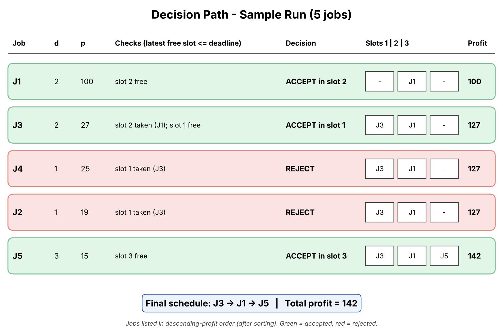

# Greedy Job Sequencing with Deadlines

## Description
This project implements the Job Sequencing with Deadlines problem using the greedy
method and visualizes the job selection process as a flowchart and a step-by-step
decision path. Each job takes one unit of time and earns its profit only if it finishes
on or before its deadline. The goal is to pick jobs that maximize total profit.

## Algorithm
```
JobSequencing(jobs[1..n]):
    sort jobs in descending order of profit
    maxD = maximum deadline among all jobs
    slot[1..maxD] = empty;  totalProfit = 0
    for each job J in sorted order:
        t = min(J.deadline, maxD)
        while t >= 1 and slot[t] is occupied:
            t = t - 1                      // look for an earlier free slot
        if t >= 1:
            slot[t] = J;  totalProfit += J.profit      // ACCEPT
        else:
            reject J                                   // REJECT
    return slot[], totalProfit
```
**Complexity:** O(n log n) for sorting + O(n * maxD) for slot search, i.e. O(n^2) in the worst case.

**Why greedy works:** taking the most profitable job first and placing it as late as
possible keeps earlier slots free for other jobs with tight deadlines.

## Prompt Used
"Create a flow diagram showing job selection based on deadlines and profits."
(see `Prompt.txt` for the refinement prompt)

## Sample Input and Output
| Job | Deadline | Profit |
|-----|----------|--------|
| J1  | 2 | 100 |
| J2  | 1 | 19  |
| J3  | 2 | 27  |
| J4  | 1 | 25  |
| J5  | 3 | 15  |

Sorted by profit: J1, J3, J4, J2, J5

| Job | Decision | Slots (1,2,3) | Profit |
|-----|----------|---------------|--------|
| J1 | Accept, slot 2 | - J1 - | 100 |
| J3 | Slot 2 taken, accept in slot 1 | J3 J1 - | 127 |
| J4 | Slot 1 taken, reject | J3 J1 - | 127 |
| J2 | Slot 1 taken, reject | J3 J1 - | 127 |
| J5 | Accept, slot 3 | J3 J1 J5 | 142 |

**Final schedule: J3 -> J1 -> J5, Total profit = 142** (matches `output.txt`).

## Output
- Algorithm flowchart: `Visualization.png`

  

- Decision path for the sample run: `Visualization_Trace.png`

  

**How the visualization works:** diamonds are decisions (more jobs left? is the slot
free? is t >= 1?), blue boxes are processing steps, green boxes are accepted jobs and
red boxes are rejected jobs. The trace image follows each job through those decisions
and shows the slot table filling up.

## How to Run
```
g++ -O2 -o job Project4_JobSequencing.cpp && ./job
python3 generate_visualization.py     # regenerates the PNG files (needs matplotlib)
```

## Learning Outcome
- Understood the greedy strategy for job sequencing with deadlines.
- Learned to trace decision paths (accept / reject) through an algorithm.
- Learned prompt-based visualization.
- Practiced GitHub documentation.
