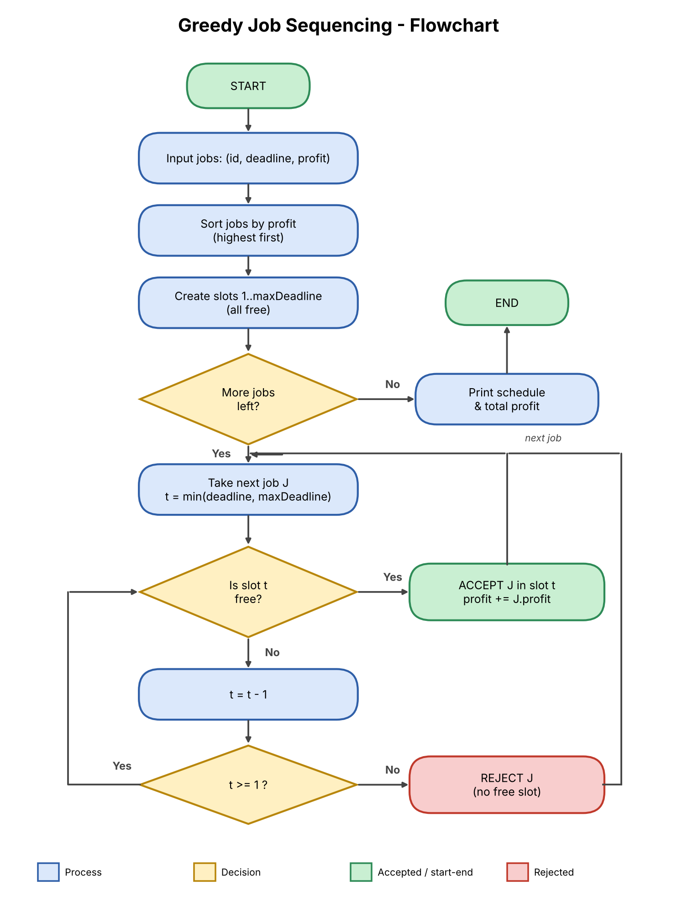

# Greedy Job Sequencing with Deadlines

## Description
This project implements Job Sequencing with Deadlines using the greedy method and
visualizes job selection as a flowchart plus a step-by-step decision path. Each job
takes one unit of time and earns its profit only if it is finished on or before its
deadline. The goal is to maximize total profit.

## Algorithm
```
JobSequencing(jobs[1..n]):
    sort jobs in descending order of profit
    maxD = maximum deadline;  slot[1..maxD] = empty;  totalProfit = 0
    for each job J in sorted order:
        t = min(J.deadline, maxD)
        while t >= 1 and slot[t] is occupied:
            t = t - 1
        if t >= 1:
            slot[t] = J;  totalProfit += J.profit      // ACCEPT
        else:
            reject J                                   // REJECT
    return slot[], totalProfit
```
Time complexity: O(n log n) for sorting + O(n * maxD) for slot search (O(n^2) worst case).

## Prompt Used
"Create a flow diagram showing job selection based on deadlines and profits."

## Output
Sample input: J1(d=2, p=100), J2(d=1, p=19), J3(d=2, p=27), J4(d=1, p=25), J5(d=3, p=15)

Result: schedule **J3 -> J1 -> J5**, total profit **142** (J4 and J2 rejected because slot 1 is taken).



Left: flowchart of the algorithm (diamonds = decisions). Right: decision path for the
sample run, with accepted jobs in green, rejected jobs in red, and the slots filling up.

Run: `g++ -o job Project4_JobSequencing.cpp && ./job` - prints the decision path shown in `Visualization.png`.

## Learning Outcome
- Understood the greedy strategy for job sequencing with deadlines.
- Learned to trace accept/reject decision paths through an algorithm.
- Learned prompt-based visualization.
- Practiced GitHub documentation.
